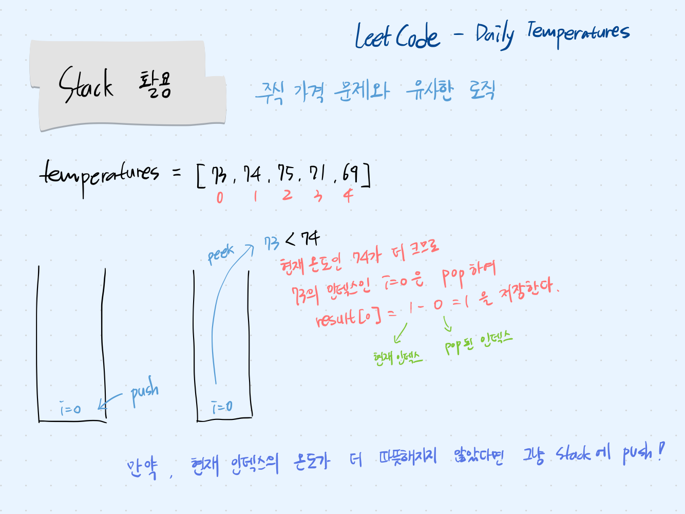

## 문제 파악

각 날짜에서 며칠 후에 더 따뜻한 날이 오는지를 구하는 문제이다. 즉, 현재 인덱스의 값으로부터 값이 더 큰 인덱스까지의 거리를 배열에 저장하고, 만약 더 큰 값이 없다면 0을 저장한다.

## 접근 방법

- 주식 가격 문제와 유사한 로직으로 접근하지만, 이 문제에서는 더 따뜻한 날이 없다면 0을 저장하라고 명시되어 있기 때문에 남은 인덱스를 처리할 필요는 없다.




## 코드 구현

💟 Stack 사용

```java
import java.util.*;

class Solution {
    public int[] dailyTemperatures(int[] temperatures) {
		    // 각 날짜마다 더 따뜻한 날이 오기까지의 기간을 저장할 배열 선언
        int result[] = new int[temperatures.length];
        Deque<Integer> stack = new ArrayDeque<>();
				
				// temperatures 배열 순회
        for(int i = 0; i < temperatures.length; i++) {
            while(!stack.isEmpty()) {
		            // Stack의 최상위 값 조회
                int j = stack.peek();
                // 현재 온도가 이전 온도보다 높으면 result에 현재 온도 인덱스 - 이전 온도 인덱스 값 저장
                if(temperatures[i] > temperatures[j]) {
                    result[j] = i - j;
                    stack.pop();
                }
                else break;
            }
            // 현재 온도가 이전 온도보다 높지 않다면 그냥 Stack에 push
            stack.push(i); 
        }
        return result;
    }
}
```

## 배우게 된 점

주식 가격 문제를 확실히 이해한 뒤, 문제를 풀게되어 상대적으로 간단하게 느껴졌다. 즉, 하나의 로직을 제대로 이해하면 비슷한 유형의 문제들을 해결하는 데 큰 문제가 없다는 점을 깨달았다.