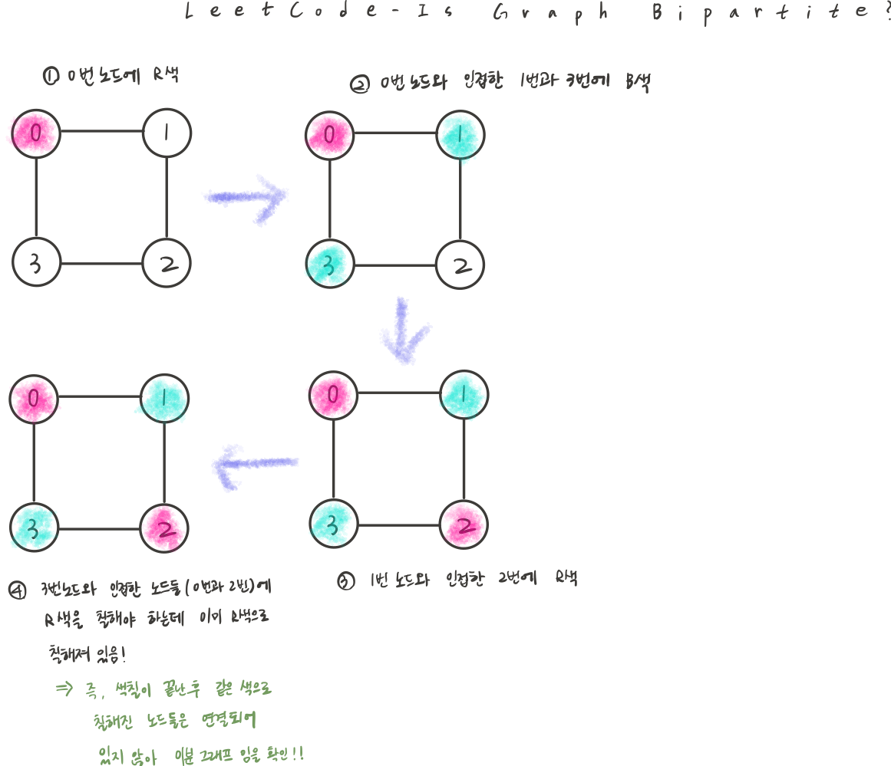

## 문제 파악

- 노드 번호가 0부터 n-1까지 있는 무방향 그래프가 인접 리스트 형태로 주어졌다.
- `graph[u]`에 있는 각 노드 `v`에 대해 노드 `u`와 `v` 사이에는 무방향 간선이 존재한다.
    - 그래프 조건
        - 자기 자신과 연결된 간선은 존재하지 않음 (`graph[u]`에 `u`는 없음)
        - 중복된 간선 없음 (`graph[u]`에 중복된 노드 없음)
        - 무방향 그래프 → `u`가 `v`에 연결되어 있다면, `v`도 `u`에 연결
        - 그래프가 분리된 컴포넌트로 존재할 수 있음
- 즉, 주어진 그래프가 이분 그래프인지 확인하는 문제이다.

<aside>

😁 그래프의 모든 노드를 두 개의 그룹으로 나눌 수 있고, 모든 간선이 서로 다른 그룹에 속한 노드들만 연결한다면, 그 그래프는 이분 그래프의 조건을 만족시킨다.

</aside>

## 접근 방법

1. BFS로 이분 그래프 판별



- BFS로 모든 노드를 탐색하면서 인접한 두 노드가 항상 서로 다른 색이 칠해지도록 한다.
- 아직 방문하지 않은 노드에서 BFS를 시작하고, 인접한 두 노드가 같은 색이 색칠되어 있다면 false를 반환한다.
- 탐색이 끝난 후, 같은 색으로 칠해진 노드들이 연결되어 있지 않다면 true를 반환한다.
- `0은 미방문` , `1과 -1로 두 색(R색과 B색) 구분`

## 코드 구현

💟 BFS

```java
import java.util.*;

class Solution {
    public boolean isBipartite(int[][] graph) {
        Queue<Integer> queue = new ArrayDeque<>(); // 실행시간 -> 1ms
        //Queue<Integer> queue = new LinkedList<>(); 실행시간 -> 2ms
        
        // 미방문: 0, 두가지 색 구분: 1과 -1
        int[] color = new int[graph.length];
        Arrays.fill(color, 0); // 초기 값은 모두 방문하지 않은 상태
				
				// 모든 노드 탐색 
        for(int i = 0; i < graph.length; i++) {
            if(color[i] != 0) continue; // 이미 색칠된 노드(방문한 노드)는 pass
						
						// BFS 시작
            queue.offer(i); // 0번 노드부터 enqueue
            color[i] = 1; // 시작노드를 1번색으로 지정
						
						// 큐가 empty 될 때까지 반복
            while(!queue.isEmpty()) {
                int current = queue.poll(); // queue에서 현재 방문할 노드 dequeue
                
                // 현재 노드와 연결된 모든 노드 탐색
                for(int next : graph[current]) {
		                // 연결된 노드가 아직 방문하지 않은 노드라면
                    if(color[next] == 0) {
		                   // 현재 노드와 다른 색(-1번색)으로 지정
                        color[next] = -color[current];
                        queue.offer(next);
                    }
                    // 인접노드와 색이 같으면 false 반환
                    else if(color[next] == color[current]) {
                        return false;
                    }
                }
            }
        }
        return true;
    }
}
```

❣️ BFS에서는 ArrayDeque 사용하기

## 배우게 된 점

이 문제는 모든 노드를 탐색하면서 인접한 노드와의 색이 같은지를 확인해야 하기 때문에, 재귀 호출 방식의 DFS보다는 BFS가 더 효율적이라고 생각했다. 즉, 이분 그래프 판별은 그래프를 레벨 순회하는 것이 더 안정적임을 깨달았다.