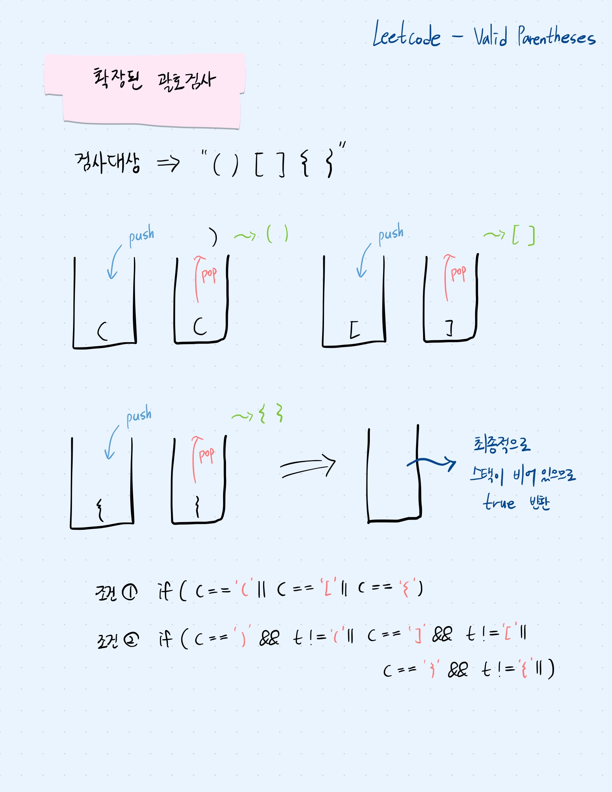

## 문제 파악

프로그래머스 올바른 괄호 문제의 확장 버전으로 (), {}, [] → 세 종류의 괄호를 모두 검사한다.

## 접근 방법

- 올바른 괄호 문제와 같은 로직으로 접근할 수 있지만, 괄호의 종류가 늘어났기 때문에, 괄호 검사 조건을 추가할 필요가 있다.



## 코드 구현

💟 Stack 사용(직접 해결한 방식)

```java
import java.util.*;

class Solution {
    public boolean isValid(String s) {
        Stack<Character> stack = new Stack<>();
				
				// 여는 괄호를 만나면 stack에 push
        for (char c : s.toCharArray()) {
           if (c == '(' || c == '[' || c == '{') {
                stack.push(c);
           }
           else{
		            // 닫는 괄호를 만났을 때, stack이 비어있으면 false 반환 
                if(stack.isEmpty()) {
                    return false;
                }
                // pop한 괄호가 아래 조건을 만족하지 못하면 false 반환
                char t = stack.pop();
                if(c == ')' && t != '(' || c == ']' && t != '[' || c == '}' && t != '{') {
                    return false;
                }
           }
        }
        // 모든 괄호 검사가 끝났을 때, stack이 비어있으면 올바른 괄호
        return stack.isEmpty();
    }
}
```

💟 Deque 사용(성능 개선)

```java
import java.util.*;

class Solution {
    public boolean isValid(String s) {
        Deque<Character> stack = new ArrayDeque<>();

        for (char c : s.toCharArray()) {
           if (c == '(' || c == '[' || c == '{') {
                stack.push(c);
           }
           else{
                if(stack.isEmpty()) {
                    return false;
                }
                char t = stack.pop();
                if(c == ')' && t != '(' || c == ']' && t != '[' || c == '}' && t != '{') {
                    return false;
                }
           }
        }
        return stack.isEmpty();
    }
}
```

## 배우게 된 점

자바 공식 문서에서 Deque를 사용을 권장하고 있으므로, Stack 보다는 Deque를 사용하는 것에 익숙해질 필요가 있음을 느꼈다.

❣️ 공식 문서 참고 링크

https://docs.oracle.com/javase/8/docs/api/java/util/ArrayDeque.html