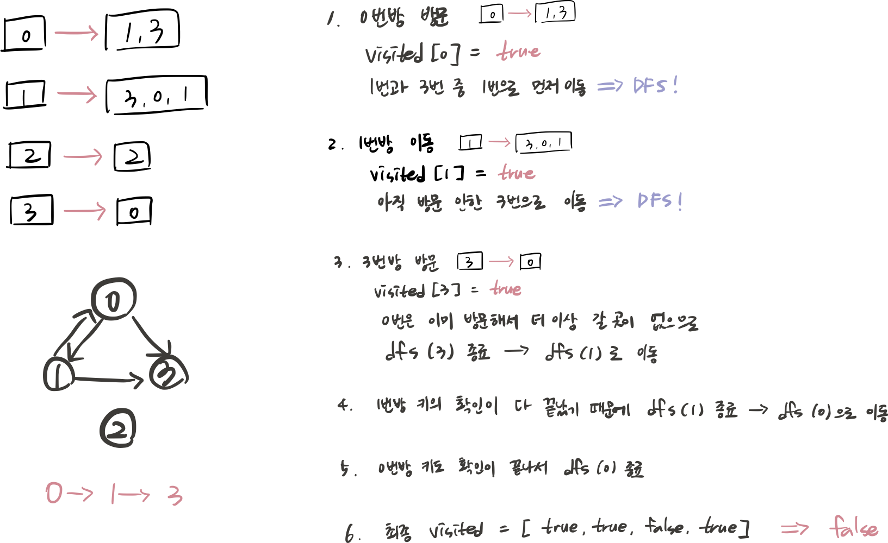

## 문제 파악

0번 방부터 시작해서 키를 모아 다른 방을 열어가면서, 최종적으로 모든 방을 방문할 수 있는지 여부를 확인하는 문제이다.


## 접근 방법

- 인접 리스트 형태로 주어진 rooms를 0번 방부터 DFS 탐색하여 방문할 수 있는 모든 방을 방문한다.
- 탐색이 끝난 후, 방문하지 못한 방이 하나라도 있으면 false를 반환하고, 모두 방문했다면 true를 반환한다.



## 코드 구현

💟 인접리스트로 DFS 탐색 (직접 해결한 방식)

```java
class Solution {
    public boolean canVisitAllRooms(List<List<Integer>> rooms) {
		    // rooms의 배열 사이즈만큼 방의 총 개수 저장할 변수 선언(바뀌면 안 되는 값이라 final로..)
        final int N = rooms.size(); 
        boolean[] visited = new boolean[N]; // 방문 여부 저장하는 배열
        
        dfs(rooms, visited, 0); // 0번 방부터 dfs 방문 시작
				
				// 모든 방을 방문했는지 확인하기 위해 visited 배열 순회 
        for(boolean v : visited){
            if (!v) return false; // 탐색 중 방문하지 않은 방이 있다면 즉시 false 반환 
        }
        return true;
    }
    // dfs 함수
    public void dfs(List<List<Integer>> rooms, boolean[] visited, int currentRoom) {
        visited[currentRoom] = true; // 현재 방문한 방은 방문 처리
        
        // 현재 방문한 방에 있는 모든 키 확인 
        for(int key: rooms.get(currentRoom)) {
            if(!visited[key]) { // 아직 방문하지 않은 방이 있다면 dfs 재귀 호출하여 방문
                dfs(rooms, visited, key);
            }
        }
    }
}
```

## 배우게 된 점

인접행렬로 표현된 그래프의 경우 모든 정점을 확인해야 해서 코드가 복잡해지는 것 같은데, 인접리스트로 표현하면 연결된 정점만 효율적으로 탐색할 수 있어 구현이 훨씬 간단하고, 전체적인 난이도 또한 더 쉽게 느껴졌다.