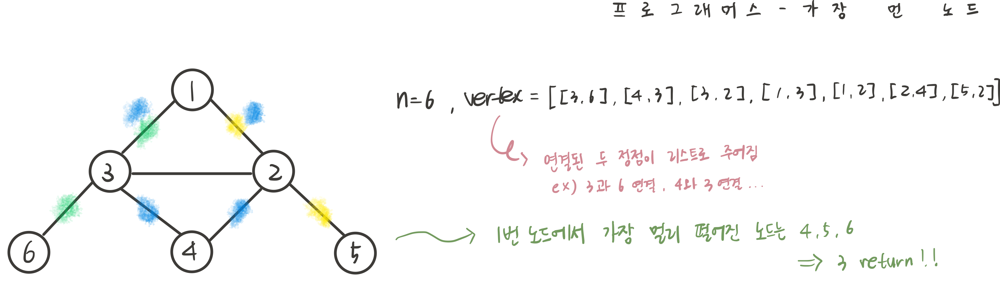
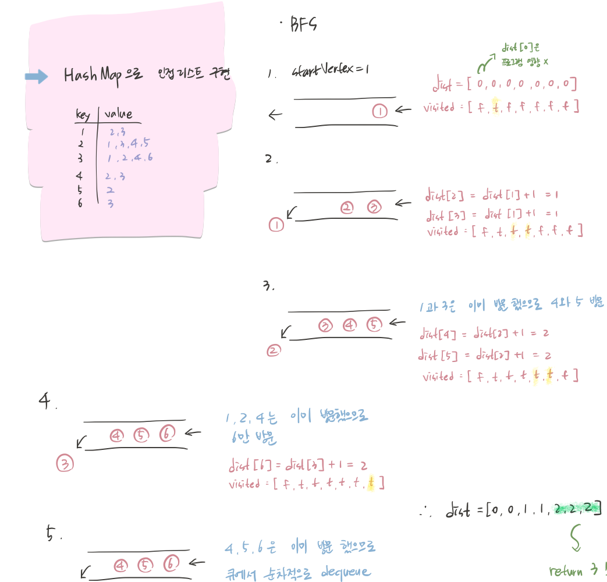

## 문제 파악



## 접근 방법

- 주어진 vertex는 연결된 두 정점이 리스트이다. 즉, 간선 목록 형태이므로, HashMap을 사용하여 인접리스트로 변환한다.
- 모든 간선의 가중치는 같고, 최단 거리를 구해야 하므로 BFS를 수행한다.
- BFS 함수에서는 각 노드까지의 최단 거리를 저장한 배열이 필요하므로, void가 아닌 int[]를 반환하도록 한다.
- BFS를 통해 1번 노드로부터 각 노드까지의 최단 거리를 구한 뒤, 가장 먼 거리를 가진 노드들의 개수를 카운트한다.



## 코드 구현

💟 정답 코드 (직접 해결한 방식)

```java
import java.util.*;

class Solution {
    public int solution(int n, int[][] edge) {
			 // HashMap으로 그래프 생성
       Map<Integer, List<Integer>> graph = new HashMap<>();
			  // 각 노드마다 빈 리스트 생성 (노드 번호가 1부터 시작하므로 i = 1부터 시작)
        for(int i = 1; i <= n; i++) {
            graph.put(i, new ArrayList<>());
        }
				// edge 배열을 탐색하면서 서로 연결된 노드들을 인접 리스트에 추가
        for(int[] e: edge) {
            int a = e[0];
            int b = e[1];
            
						// 양방향 연결이므로 a에도 b를 추가하고, b에도 a추가
            graph.get(a).add(b);
            graph.get(b).add(a);
        }
				// 1번 노드에서 BFS 호출, dist는 최단 거리 저장할 배열
        int[] dist = bfs(graph, n, 1);
        
        int max = 0;
				// 최단 거리 배열인 dist 순회하면서 최대값 찾기
        for(int d : dist) {
            if(d > max) max = d;
        }
        
        int cnt = 0;
				// dist 배열 순회하면서 위에서 찾은 최대값과 같은 거리를 발견하면 카운팅
        for(int d : dist) {
            if(d == max) cnt++;
        }
        return cnt;  
    }
    public int[] bfs(Map<Integer, List<Integer>> graph, int n, int startVertex) {
				// BFS 탐색에 사용할 queue 생성
        Queue<Integer> queue = new LinkedList<>();
        int[] dist = new int[n+1]; // 최단 거리를 저장할 배열 선언, 노드 번호 1번부터 사용(n+1)
        boolean[] visited = new boolean[n+1]; // 방문 여부 저장할 배열 선언
        
        queue.offer(startVertex); // 탐색할 노드 큐에 enqueue (offer 대신 add도 사용 가능)
        visited[startVertex] = true; // 방문 처리
        
				// queue가 empty 될 때까지 반복
        while(!queue.isEmpty()) {
					  // queue에서 dequeue해서 현재 방문할 노드로 설정 (remove 대신 poll 사용 가능)
            int currentVertex = queue.remove(); 
						// 현재 방문한 노드에 연결된 모든 이웃 노드를 탐색
            for(int nextVertex : graph.get(currentVertex)) {
                if(!visited[nextVertex]) {
                    visited[nextVertex] = true; // 아직 방문하지 않은 노드라면 방문 처리
                    dist[nextVertex] = dist[currentVertex] + 1; // 현재 노드의 거리 + 1 수행하여 거리 배열 갱신
                    queue.offer(nextVertex); // 방문하지 않은 인접 노드 큐에 enqueue
                }
            }
        }
        return dist;
    }
}
```

💟 오답 코드

```java
import java.util.*;

class Solution {
    public int solution(int n, int[][] edge) {
       Map<Integer, List<Integer>> graph = new HashMap<>();
        for(int i = 0; i < n; i++) {
            graph.put(i, new ArrayList<>());
        }
        for(int[] e: edge) {
            int a = e[0];
            int b = e[1];
            
            graph.get(a).add(b);
            graph.get(b).add(a);
        }
        int[] dist = bfs(graph, n, 1);
        
        int max = 0;
        for(int d : dist) {
            if(d > max) max = d;
        }
        
        int cnt = 0;
        for(int d : dist) {
            if(d == max) cnt++;
        }
        return cnt;  
    }
    public int[] bfs(Map<Integer, List<Integer>> graph, int n, int startVertex) {
        Queue<Integer> queue = new LinkedList<>();
        int[] dist = new int[n+1];
        boolean[] visited = new boolean[n+1];
        
        queue.offer(startVertex);
        visited[startVertex] = true;
        
        while(!queue.isEmpty()) {
            int currentVertex = queue.remove();
            for(int nextVertex : graph.get(currentVertex)) {
                if(!visited[nextVertex]) {
                    visited[nextVertex] = true;
                    dist[nextVertex] = dist[currentVertex] + 1;
                    queue.offer(nextVertex);
                }
            }
        }
        return dist;
    }
}
```

- for(int i = 0; i < n; i++) {
  graph.put(i, new ArrayList<>());
  } // 그래프에 0번 노드가 없는데 i = 0부터 시작하여 index 오류 발생

## 배우게 된 점

BFS 템플릿을 외워서 사용하다보니, 문제에서 주어진 노드 번호를 고려하지 않고 i = 0 부터 입력하여 index 오류가 발생했다. 자주 등장하면서 어느정도 틀이 정해져 있기 때문에 템플릿을 외우는 것도 중요하지만, 문제마다 적용하는 방식이 조금씩 다를 수 있으므로 문제를 꼼꼼히 확인하는 습관이 필요하다는 점을 깨달았다.