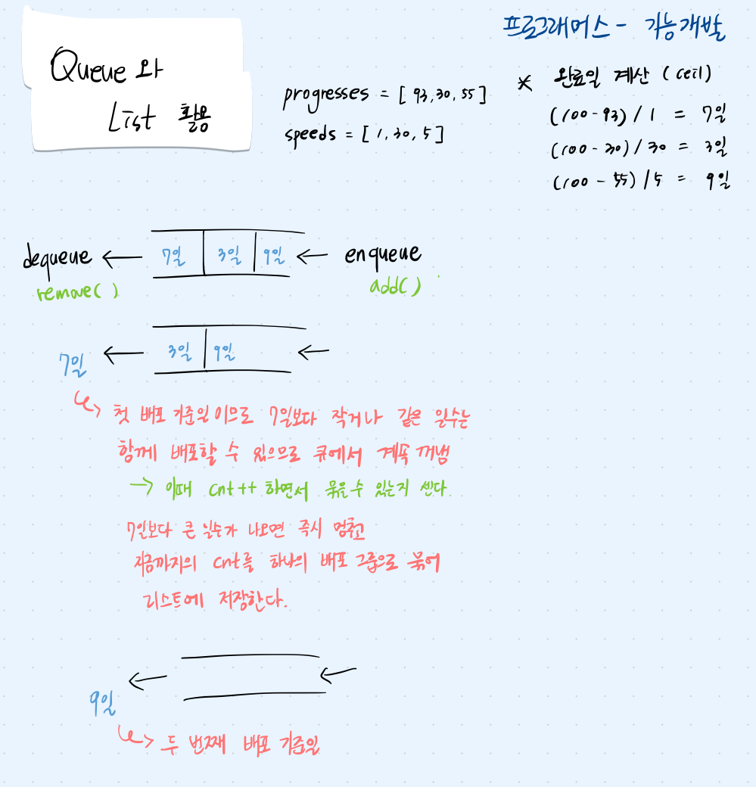

## 문제 파악

각 기능마다 진행 상태와 개발 속도가 다르기 때문에, 완료되는 시점도 서로 다르다. 기능 배포는 앞에 있는 기능이 완료되어야만 순서대로 가능하다는 제약 사항이 있다. 즉, 각 기능의 완료일을 먼저 계산하여 배열에 저장한 후, 앞에서부터 배열을 순회하면서 하나의 배포에 포함될 기능의 수를 계산한다.

## 접근 방법



## 코드 구현

💟 Queue와 List 사용 (오답 코드)

```java
import java.util.*;

class Solution {
    public int[] solution(int[] progresses, int[] speeds) {
        Queue<Integer> queue = new ArrayDeque<>();
        List<Integer> result = new ArrayList<>();
        
        for(int i = 0; i < progresses.length; i++) {
            int days = (int) Math.ceil((100.0 - progresses[i]) / speeds[i]);
            queue.add(days);
        }
        
        while(!queue.isEmpty()) {
            int standard = queue.remove();
            int cnt = 1;
            
            while(!queue.isEmpty() && queue.peek() <= standard) {
                queue.remove();
                cnt++;
            }
            result.add(cnt);
        }
        return result;
    }
}
```

- List로 반환하여 int[ ] 형변환이 되지 않아 오답 코드

💟 Queue와 List 사용 (정답 코드)

```java
import java.util.*;

class Solution {
    public int[] solution(int[] progresses, int[] speeds) {
		    // 각 기능의 완료일을 저장할 큐
        Queue<Integer> queue = new ArrayDeque<>();
        // 배포될 기능 개수를 저장할 리스트
        List<Integer> result = new ArrayList<>();
        
        // 각 기능이 완료일을 계산하여 큐에 저장
        for(int i = 0; i < progresses.length; i++) {
		        // ceil로 올림 처리
            int days = (int) Math.ceil((100.0 - progresses[i]) / speeds[i]);
            queue.add(days); // 완료일까지 남은 날짜 큐에 enqueue
        }
        
        // 큐에서 완료일을 꺼내면서 배포가능한 묶음 계산
        while(!queue.isEmpty()) {
            int standard = queue.remove(); // 배포 기준일 dequeue
            int cnt = 1; // 기능 개수 카운트
            
            // 큐가 비어있지 않고, 큐의 peek가 배포 기준일보다 작거나 같으면 같이 배포
            while(!queue.isEmpty() && queue.peek() <= standard) {
                queue.remove(); // 같이 배포할 기능 dequeue
                cnt++; // 같이 배포할 기능 추가 카운트
            }
            result.add(cnt); // 현재 배포 묶음 개수 리스트에 저장
        }
        // 리스트를 배열로 형변환 !!!
        int[] answer = new int[result.size()];
        for (int i = 0; i < result.size(); i++) {
            answer[i] = result.get(i);
        }
        return answer;
    }
}
```

## 배우게 된 점

반환 타입을 고려하지 않아 오답이 발생했다. 자료형 간의 변환이 필요할 때 반드시 반환 타입을 확인하고 변환하는 습관이 중요하다는 점을 깨달았다.