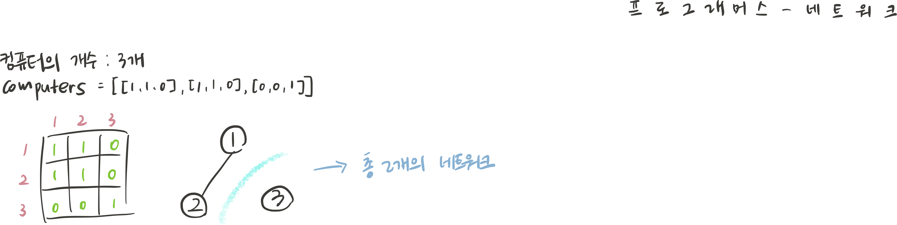
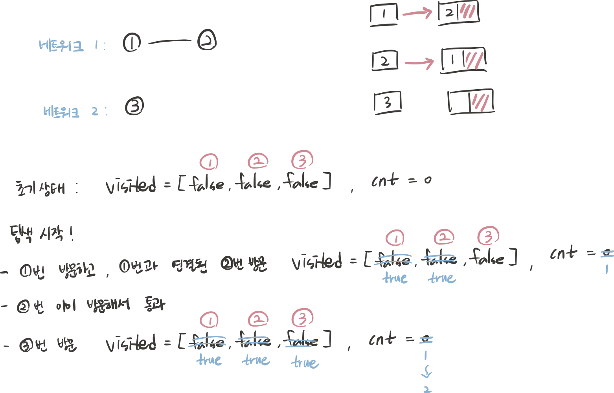

## 문제 파악

서로 연결된 컴퓨터들의 집합이 몇 개인지, 즉 그래프에서 서로 연결된 정점 집합의 수를 구하는 문제이다. 컴퓨터 간 연결 상태는 인접행렬 형태로 주어지며, 직접적으로 연결되어 있거나 여러 컴퓨터를 거쳐 간접적으로 연결된 경우 모두 하나의 네트워크를 간주한다. 따라서 이 문제는 그래프에서 연결된 컴포넌트의 개수를 찾는 문제라고 할 수 있다.



## 접근 방법

1. 주어진 인접행렬(computers)을 인접리스트로 변환 후 DFS 탐색
- computers 배열을 List<List<Integer>>로 변환한다.
- vistied 배열에 각 컴퓨터가 이미 탐색됐는지 표시한다.
- 1번 컴퓨터부터 순서대로 탐색하면서 아직 방문하지 않은 컴퓨터이면 해당 컴퓨터에서 DFS 탐색을 시작한다.
- DFS 내에서 다음 컴퓨터로 갈 때 방문 여부를 미리 확인한 후, 방문하지 않은 컴퓨터만 재귀 호출한다.
- DFS 탐색이 한 번 끝날 때마다 네트워크 개수를 1개 증가시킨다.



1. 주어진 인접행렬(computers)을 바로 DFS 탐색
- computers 배열을 그대로 사용하고, 로직은 1번 방식과 동일하다.
- 1번 방식과 차이가 있는 부분 1가지
    - 인접리스트 방식 : graph.get(currentVertex) 탐색
    - 인접행렬 방식 : computers[currentVertex][i] 탐색
- 문제에서 인접행렬 형태로 주어진 경우라면, 그대로 인접행렬로 푸는 것이 좋다.

## 코드 구현

💟 인접행렬(computers)을 인접리스트로 변환 후 DFS 탐색 (직접 해결한 방식)

```java
import java.util.*;

class Solution {
    public int solution(int n, int[][] computers) {
        int cnt = 0; // 네트워크 개수 저장할 변수
        
        // 인접 리스트(graph)로 변환하기 위해 각 컴퓨터마다 연결 리스트 생성
        List<List<Integer>> graph = new ArrayList<>();
        for(int i = 0; i < n; i++) {
            graph.add(new ArrayList<>());
        }
        // 인접행렬(computers)를 인접리스트(graph)로 변환
        for(int i = 0; i < n; i++) { // 인접행렬 탐색
            for(int j = 0; j < n; j++) {
		            // 자기 자신과의 연결은 제외하고, 다른 컴퓨터와 연결되어 있는 경우만 추가
                if(i != j && computers[i][j] == 1) {
                    graph.get(i).add(j);
                }
            }
        }
        
        // 각 컴퓨터 탐색 여부 저장할 배열
        boolean[] visited = new boolean[n];
        
        // 모든 컴퓨터 순회
        for(int i = 0; i < n; i++) {
		        // 아직 방문하지 않은 컴퓨터이면, DFS 탐색 시작
            if(!visited[i]) {
                dfs(graph, visited, i);
                cnt++; // DFS 탐색 끝나면 네트워크 1개를 모두 방문했기 때문에 네트워크 개수 카운팅
            }
        }
        return cnt; // 네트워크 개수 반환
    }
    // 재귀 호출할 DFS 탐색 홤수
     public void dfs(List<List<Integer>> graph, boolean[] visited, int currentVertex) {
        visited[currentVertex] = true; // 현재 컴퓨터 방문 처리
        
        // 현재 컴퓨터와 직접 연결된 컴퓨터들을 확인
        for(int nextVertex : graph.get(currentVertex)) {
		        // 방문하지 않은 컴퓨터라면 DFS 재귀 호출
            if(!visited[nextVertex]) {
                dfs(graph, visited, nextVertex);
            }
        }
    }
}
```

💟 인접행렬(computers)을 바로 DFS 탐색

```java
import java.util.*;

class Solution {
    public int solution(int n, int[][] computers) {
        int cnt = 0; // 네트워크 개수 저장할 변수
        boolean[] visited = new boolean[n]; // 각 컴퓨터 탐색 여부 저장할 배열
        
        // 모든 컴퓨터 탐색 시작
        for(int i = 0; i < n; i++) {
            if(visited[i]) continue; // 이미 방문했던 컴퓨터는 통과
            dfs(n, computers, visited, i); // 방문하지 않은 컴퓨터는 DFS 호출하여 연결된 컴퓨터 모두 탐색
            cnt++; // DFS 탐색 끝나면 네트워크 1개를 모두 방문했기 때문에 네트워크 개수 카운팅
        }
        return cnt;
    }
    
    // 재귀 호출할 DFS 탐색 홤수
    void dfs(int n, int[][] computers, boolean[] visited, int currentVertex) {
        visited[currentVertex] = true; // 현재 컴퓨터 방문 처리
        
        // 현재 컴퓨터와 직접 연결된 컴퓨터들을 확인
        for(int i = 0; i < n; i++) {
		        // 방문하지 않은 컴퓨터이면서 연결되어 있다면 DFS 재귀 호출
            if(!visited[i] && computers[currentVertex][i] == 1) {
                dfs(n, computers, visited, i);
            }
        }
    }
}
```

## 배우게 된 점

이 문제는 인접행렬이 주어졌기 때문에, 인접행렬을 그대로 탐색하는 방식이 더 효율적이다. 하지만, 한 번 새롭게 풀어보고자 인접리스트로 변환하여 풀어보았는데 코드가 길어지고 풀이 시간이 오래 걸렸다. 실제 코딩테스트에서는 문제가 인접행렬로 주어지면 변환하지 않고, 그대로 사용하는 것이 적절하다는 점을 깨달았다.