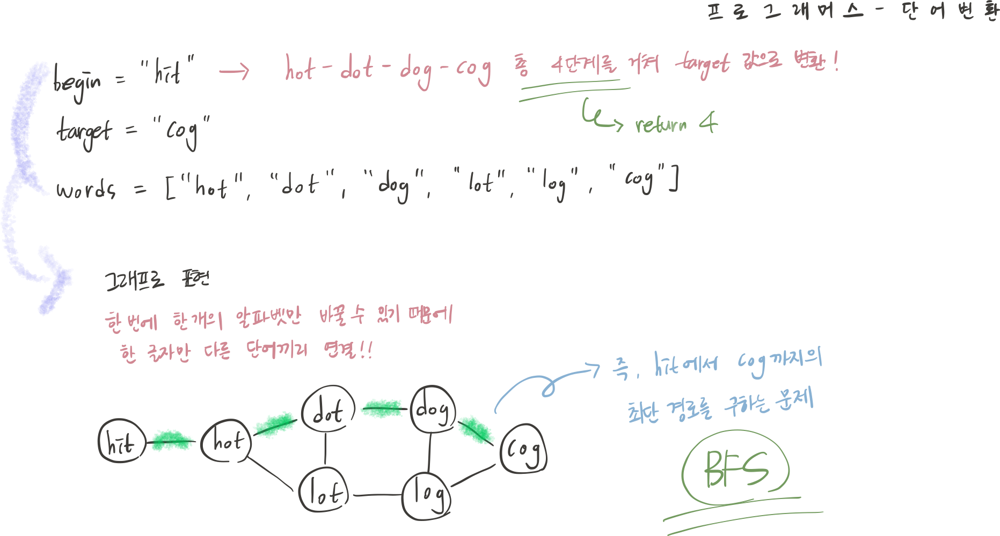

## 문제 파악



begin → target 까지의 최단 거리를 구하는 문제이다.

## 접근 방법

🧷 문제 조건

- 한 번에 한 글자만 변경 가능하다.
- 바꾼 단어는 반드시 words에 존재해야 한다.
- 각 단어를 하나의 노드로 생각한다.

➡️ BFS 탐색

1. begin 단어를 시작 노드로 하여 queue 넣고 방문 처리한다.
2. queue에서 단어를 하나씩 dequeue하면서, 한 글자만 다른 인접 단어들을 탐색한다.
3. 조건에 부합하는 인접 단어들을 queue에 추가하고, 거리를 +1 카운팅한다.
4. target에 해당하는 단어에 도착하면, 그 단어까지의 최단 거리를 반환한다.
5. 모든 단어를 탐색했음에도 target에 도달하지 못하면, 0을 반환한다.

## 코드 구현

💟 BFS 탐색하여 최단 거리 반환 (직접 해결한 방식)

```sql
import java.util.*;

class Solution {
    public int solution(String begin, String target, String[] words) {
        Queue<String> queue = new ArrayDeque<>();
        boolean[] visited = new boolean[words.length];
        int cnt = 0; // 단어 변환 카운팅 변수
        
        queue.offer(begin); // 시작 단어 begin 큐에 enqueue
        
        // 큐가 empty 될 때까지 BFS 탐색 시작
        while(!queue.isEmpty()){
		        int size = queue.size();
		        
		        // 현재 단계의 모든 단어 탐색 
            for(int i = 0; i < size; i++){
                String current = queue.poll(); // 큐에서 현재 단어 dequeue
                
                // target 단어에 도달했다면 현재 cnt 반환
                if(current.equals(target)) return cnt;
                
                // 한 글자 차이나는 인접 단어 탐색
                for(int j = 0; j < words.length; j++){
		                // 아직 방문하지 않았고, 한 글자 차이나는 단어라면 방문 처리
                    if(!visited[j] && wordCheck(current, words[j])){
                        visited[j] = true;
                        queue.offer(words[j]); // 다음 단어 큐에 enqueue             
		                }
		            }
            }
            cnt++; // 현재 단계 끝나서 거리 카운팅
        }
        return 0; // target 단어에 도달하지 못하면 0 반환
    }
    // 두 단어 비교/확인 함수
    // 두 단어가 한 글자만 다를 경우 true 반환
    public boolean wordCheck(String word, String target) {
        int diff = 0;
        for(int i = 0; i < word.length(); i++) {
		        // word를 순회하면서 target의 문자와 다를 때마다 diff 카운팅
            if(word.charAt(i) != target.charAt(i)) diff++;
            if(diff > 1) return false; // 2글자 이상 다르면 false 반환
        }
        return diff == 1; // 한 글자만 다른 경우
    }
}
```

## 배우게 된 점

코딩테스트에서 최단 거리 문제는 BFS로 단계를 하나씩 카운팅해 나가는 방식이 가장 직관적이며, 다른 방법들에 비해 구현이 간단한 것 같다는 점을 깨달았다.