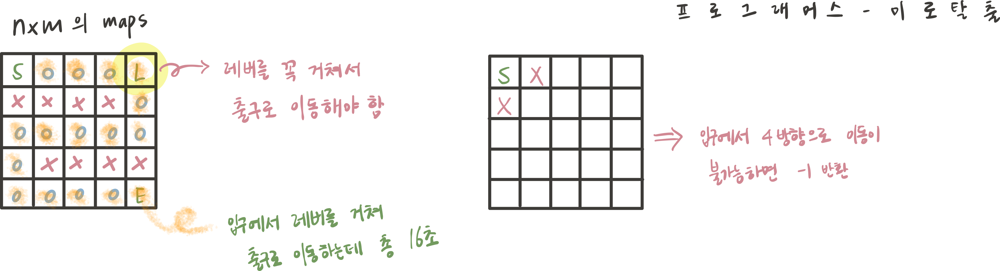

## 문제 파악

- S → L → E 로 가는 최단 경로를 구하는 문제이다.



## 접근 방법

- BFS 탐색 2번 실행
    1. S → L 까지의 최단 거리를 탐색하는 첫 번째 BFS 실행한다.
    2. L → E 까지의 최단 거리를 탐색하는 두 번째 BFS 실행
    3. 두 거리의 합을 최종 반환하고, 만약 하나라도 도착할 수 없다면 -1을 반환한다.

- 주어진 maps는 문자열 배열이므로 chartAt()로 문자를 탐색한다.

## 코드 구현

💟 S → L → E 의 최단 경로 BFS 탐색
- BFS 함수 인자로 visited 전달
- dist 배열로 분리

```angular2html
import java.util.*;

class Solution {
    static int[] dx = {0,0,-1,1};
    static int[] dy = {1,-1,0,0};
    static int m, n;
    
    public int solution(String[] maps) {
        m = maps.length;
        n = maps[0].length();
        
        int sx = 0, sy = 0;
        int lx = 0, ly = 0;
        
        for(int i = 0; i < m; i++){
            for(int j = 0; j < n; j++){
                char c = maps[i].charAt(j);
                if(c == 'S'){
                    sx = i;
                    sy = j;
                } else if(c == 'L'){
                    lx = i;
                    ly = j;
                }
            }
        }
        
        int d1 = BFS(maps, new boolean[m][n], sx, sy, 'L');
        if(d1 == -1) return -1;
        
        int d2 = BFS(maps, new boolean[m][n], lx, ly, 'E');
        if(d2 == -1) return -1;
        
        return d1 + d2;
        
    }
    
    private int BFS(String[] maps, boolean[][] visited, int sx, int sy, char ch){
        Queue<int[]> queue = new ArrayDeque<>();
        int[][] dist = new int[m][n];
        queue.offer(new int[]{sx,sy});
        visited[sx][sy] = true;
        dist[sx][sy] = 0;
        
        while(!queue.isEmpty()){
            int[] cur = queue.poll();
            int x = cur[0], y = cur[1];
            
            for(int d = 0; d < 4; d++){
                int nx = x + dx[d];
                int ny = y + dy[d];
                
                if(nx >= 0 && nx < m && ny >= 0 && ny < n){
                    if(maps[nx].charAt(ny) != 'X' && !visited[nx][ny]){
                        visited[nx][ny] = true;
                        dist[nx][ny] = dist[x][y] + 1;
                        
                        if(maps[nx].charAt(ny) == ch) return dist[nx][ny];
                        
                        queue.offer(new int[]{nx, ny});
                    }
                }
            }
        }
        return -1;
    }
}
```