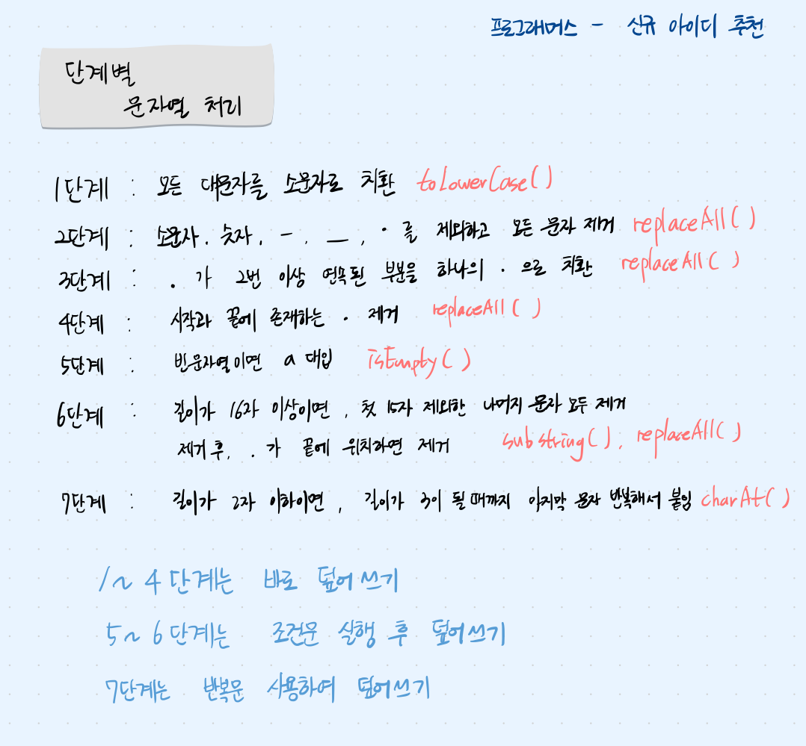

## 문제 파악

입력된 아이디에 대해 제시된 7단계의 규칙을 순차적으로 적용하며 문자열을 처리하고, 최종적으로 변환된 결과를 추천 아이디로 반환한다.

## 접근 방법

- 아이디 문자열을 순회하면서 1단계부터 7단계까지 규칙을 차례대로 적용한다. 즉, 주어진 7단계를 차례대로 new_id에 적용하면서 문자열을 처리해 나간다.
- 각 단계마다 무조건 수행하거나, 해당 조건이 충족될 때만 처리한다.



## 📝 정규식 정리

| 정규식 패턴 | 의미 |
| --- | --- |
| ^ | 문자열 시작 |
| $ | 문자열 끝 |
| . | 모든 문자 |
| [ ] | 문자 집합 ([a-z0-9]) |
| [^. . .] | 괄호 안의 문자가 아닌 경우 |
| {n, } | n번 이상 반복 |
| \\w | 알파벳/숫자/밑줄 ([a-zA-Z0-9_]) |
| \\d | 숫자 ([0-9]) |
| [ . ] | 마침표 |

## 💡 코딩테스트에서 정규식이 필요한 경우

| 상황 | 예시 |
| --- | --- |
| 문자열에서 특정 문자 제거 | [a-z0-9] 외 제거 |
| 연속된 문자 합치기 | [.]{2, } → . |
| 처음/끝 문자 제거 | `^[.] |
| 이메일 형식 확인 | \\w+@\\w+\\.\\w+ |
| 패턴 필터링 | 주민번호, 전화번호, 특수기호 등 |

## 코드 구현

💟 문자열 처리와 정규식 사용

```java
import java.util.*;

class Solution {
    public String solution(String new_id) { 
        // 1 - 4단계까지는 바로 덮어씀
        new_id = new_id.toLowerCase(); // 소문자 치환
        new_id = new_id.replaceAll("[^a-z0-9-_.]", "");
        new_id = new_id.replaceAll("[.]{2,}", ".");
        new_id = new_id.replaceAll("^[.]|[.]$", "");
        
        // 5단계 -> 아이디 문자열이 비어있는 경우 a 대입
        if(new_id.isEmpty()) {
            new_id = "a";
        }
        
        // 6단계
        if(new_id.length() >= 16) {
            new_id = new_id.substring(0,15); // 첫 15자만 남김
            new_id = new_id.replaceAll("[.]$", ""); // 끝 . 제거
        }
        
        // 7단계 -> 아이디의 길이가 3이 될 때까지 반복
        while(new_id.length() < 3) {
            new_id += new_id.charAt(new_id.length() - 1); // 마지막 문자열 추출하여 붙임
        }
        // 신규 아이디 반환
        return new_id;
    }
}
```

## 배우게 된 점

단순 조건 검사라 로직은 쉽게 떠올릴 수 있었지만, 정규식 문법을 정확히 기억하지 못해 참고하게 되었다. 코딩테스트에 자주 사용하게 될 정규식은 다시 복습하고 암기할 필요성을 느꼈다.