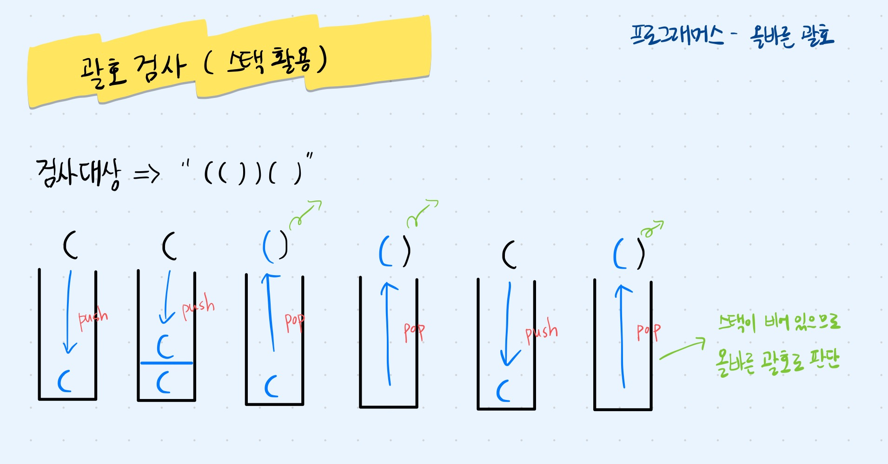

## 문제 파악

괄호로 이루어진 문자열에서 여는 괄호와 닫는 괄호가 올바르게 짝지어져 있는지를 판단한다.

## 접근 방법

- 여는 괄호를 만나면 스택에 push하고, 닫는 괄호를 만나면 스택에서 pop하여 괄호의 짝을 맞춘다.
- 이때 스택이 비어 있어 pop할 요소가 없으면 올바르지 않은 괄호이다.
- 즉, 모든 괄호를 순회한 후 스택이 비어있으면 올바른 괄호로 판단한다.



## 코드 구현

💟 Stack 사용 (직접 해결한 방식)

```java
import java.util.*;

class Solution {
    boolean solution(String s) {
        Stack<Character> stack = new Stack<>();
        
        // 괄호 문자열 순회
        for(int i = 0; i < s.length(); i++) {
            char c = s.charAt(i);
            
            // 여는 괄호를 만나면 stack에 push
            if(c == '(') {
                stack.push(c);
            }
            // 닫는 괄호를 만났을 때, stack이 비어있으면 false 반환
            else if(c == ')') {
                if(stack.isEmpty()) {
                    return false;
                }
            stack.pop();
            }
        }
        return stack.isEmpty();
    }
}
```

❣️ s는 String 타입이므로, 길이를 구할 때 s.length()처럼 괄호를 반드시 붙여야 한다.

💟 Deque과 for-each문 사용 (성능 개선)

```java
import java.util.*;

class Solution {
    boolean solution(String s) {
        Deque<Character> stack = new ArrayDeque<>();
        
        for(char c : s.toCharArray()) {
            if(c == '(') {
                stack.push(c);
            }
            else if(c == ')') {
                if(stack.isEmpty()) {
                    return false;
                }
            stack.pop();
            }
        }
        return stack.isEmpty();
    }
}
```

## 배우게 된 점

문제를 풀 때는 Stack 클래스로 정답을 맞췄지만, 해설집에서 Deque를 사용한 풀이를 접하게 되었다. 자바에서는 Stack보다 Deque가 더 효율적이고 권장된다는 점을 배웠다. 로직은 같지만, 자료구조 선택에 따라 성능이 달라질 수 있음을 알게 되었다.