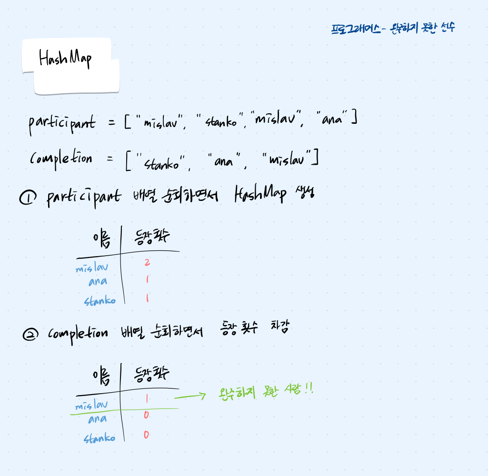

## 문제 파악

마라톤에 참가한 선수 이름이 담겨있는 participant 배열과 완주한 선수 이름이 담겨있는 completion 배열이 있을 때, 두 배열을 비교하여 완주하지 못한 선수의 이름을 반환하는 문제이다. 주의할 점은 동명이인 문제가 있을 수 있기 때문에, 단순히 이름을 제거하는 방식은 적합하지 않다.

## 접근 방법

- 동명이인 문제를 해결하기 위해 이름별로 등장 횟수를 기록하고 비교하는 방식이 적합하므로 HashMap 자료구조를 사용해야한다.
- participant 배열의 각 이름을 키로, 등장 횟수를 값으로 저장하고, completion 배열을 순회하면서 완주한 선수의 이름에 해당하는 등장 횟수를 감소시킨다.
- 순회가 끝나면, HashMap에서 등장 횟수의 값이 0이 아닌 이름을 찾아 반환한다.



## 코드 구현

💟 HashMap (직접 해결한 방식)

```java
import java.util.*;

class Solution {
    public String solution(String[] participant, String[] completion) {
        String answer = "";
        
        Map<String, Integer> hashtable = new HashMap<>();
        
        // participant 배열 순회하면서 저장
        for (String p : participant) {
            hashtable.put(p, hashtable.getOrDefault(p,0) + 1);
        }
        
        // completion 배열 순회하면서 완주한 선수 등장 횟수 차감
        for (String c : completion) {
            hashtable.put(c, hashtable.get(c) - 1);
        }
        
        // HashMap에서 등장 횟수 0이 아닌 사람의 이름 찾기
        for (String key : hashtable.keySet()) {
            if (hashtable.get(key) != 0) {
                return key;
            }
        }
        return answer;
    }
}
```

💟 정확성이 떨어지는 코드 (이전에 파이썬으로 풀었던 방식)

```python
def solution(participant, completion):
    hdict = dict()
    shash = 0
    
    for i in participant:
        hdict[hash(i)] = i
        shash += hash(i)
    
    for j in completion:
        shash -= hash(j)
    
    return hdict[shash]
```

- participant 배열에서 이름을 hash() 함수를 사용하여 해시값으로 변환하여 누적한 뒤, 완주자의 이름 해시값을 차감해 남는 해시값으로 완주하지 못한 선수의 이름을 역추적하는 방식이다.
- 코드가  짧고 간단하지만, 동명이인과 hash 충돌 문제가 발생할 수 있기 때문에 정확성과 안전성 측면에서는 좋지 않다.

## 배우게 된 점

이 문제를 이번에 HashMap으로 풀자마자, 이전에 파이썬 hash함수로 풀었던 방법이 생각나서 두 코드를 비교해 보았다. 문제를 빠르고 간단하게 푸는 것도 중요하지만, 정확성과 안전성이 중요하다는 점을 다시 한 번 깨닫는 계기가 되었다.