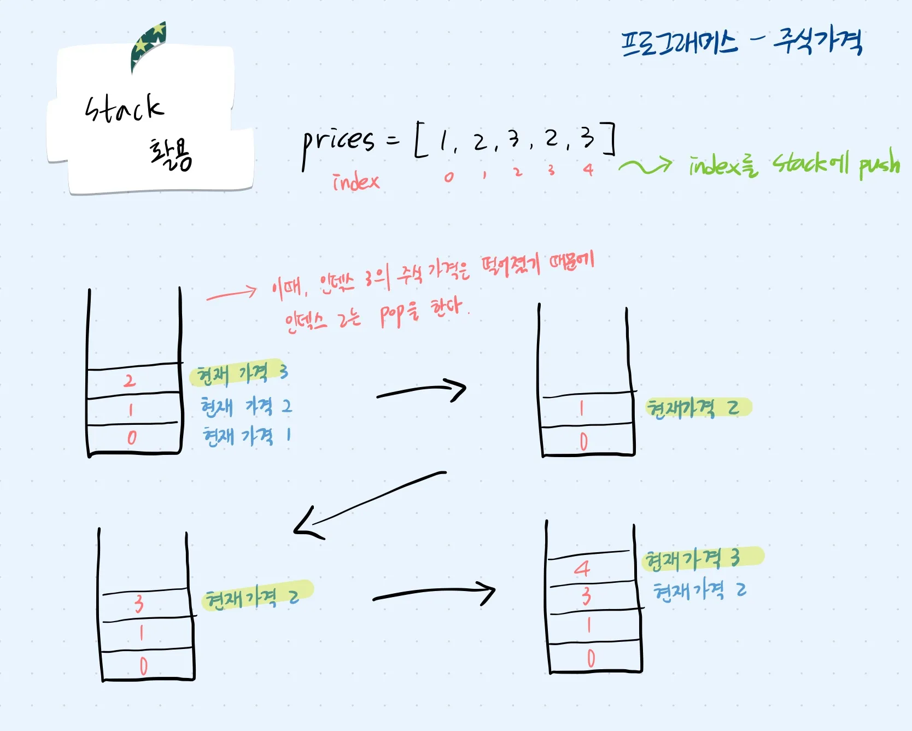

## 문제 파악

주식 가격 배열의 각 인덱스에서, 현재 가격이 이후 몇 초 동안 떨어지지 않는지를 계산하여 배열로 반환한다.

## 접근 방법

- 주식 가격 배열을 순회하면서, 현재 인덱스를 Stack에 저장한다.
- 현재 가격이 Stack의 top에 해당하는 인덱스의 가격보다 작아지는 순간, Stack에서 해당 인덱스를 pop 한다.
- 현재 인덱스 - pop된 인덱스의 값을 가격이 떨어지지 않은 기간으로 배열에 저장한다.



## 코드 구현

💟 Stack 사용

```java
import java.util.*;

class Solution {
    public int[] solution(int[] prices) {
		    // 가격이 떨어지지 않을 기간을 저장할 배열 선언
        int[] answer = new int[prices.length];
        Deque<Integer> stack = new ArrayDeque<>();
        
        // 주식 가격 배열 순회
        for(int i = 0; i < prices.length; i++) {
		        // Stack이 empty 될 때까지 반복
            while(!stack.isEmpty()) {
		            // Stack의 최상위 값 조회
                int j = stack.peek();
                // Stack의 최상위 인덱스의 가격이 현재 가격보다 큰 경우를 확인
                if(prices[j] > prices[i]) {
		                // 가격이 떨어졌으므로 인덱스의 차이를 계산
                    answer[j] = i - j; 
                    stack.pop();
                }
                else break;
            }
            // 현재 인덱스를 Stack에 push
            stack.push(i);
        }
        
        // 마지막까지 가격이 떨어지지 않은 인덱스 처리
        while(!stack.isEmpty()) {
            int i = stack.pop();
            answer[i] = prices.length - i - 1; // 배열 끝까지 유지된 시간
        }
        return answer;
    }
}
```

❣️ 인덱스 저장 시 for-each문 사용x

## 배우게 된 점

접근 방법을 떠올리는 것까지는 어렵지 않았지만, 실제로 코드를 구현하는 과정에서 값을 저장하는 것이 아니라 인덱스를 저장하다보니 혼동이 있었다. 해설집을 참고하며 코드 구현 로직을 이해하게 되어 다행이라고 생각한다.